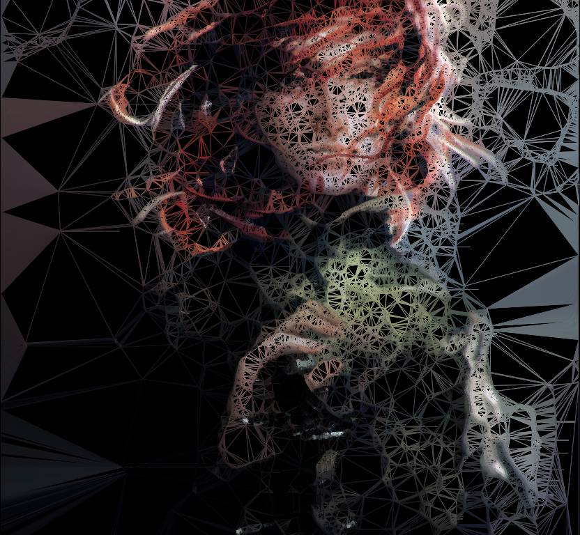

Weaver weaves a spider tapesty of your favorite bitmap image.

Assuming you have the following installed:

    SDL2

    SDL2_gfx

Just do:

    make

And use it:

    ./weaver path/to/image.bmp threshold

Play with threshold (0-255) for weave intensity. Intense weaves take a long time.

Hit END to stop weaving early. END again to exit.

Algorithm:

    0. Take an image.

    1. Blur it.

    2. Grey scale it.

    3. Sobel filter it.

    4. Threshold it.

    5. Make anything above the threshold a point.

    6. Apply all points to a Delaunay Triangle mesh.

    7. For all triangles, get pixel color of original image at triangle center and color triangle edges.
