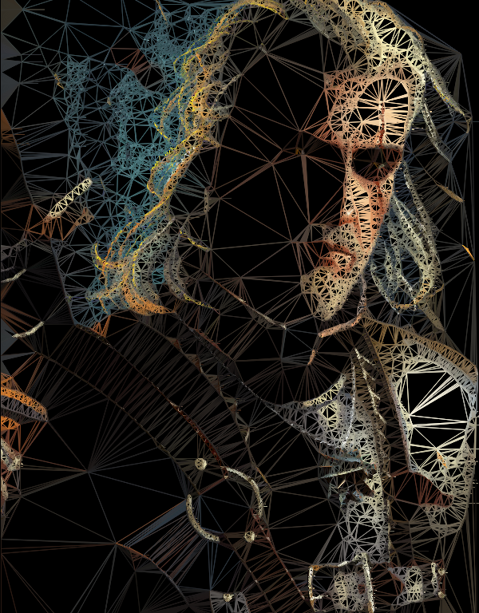

# weaver

Weaver weaves a spider tapesty of your favorite bitmap image.

Dependencies:

    SDL2

    SDL2_gfx

Just do:

    make; ./weaver path/to/image.bmp threshold

    Note: threshold (0-255) determines number of generated triangles.

Hit END to stop the process early. END again to exit.

