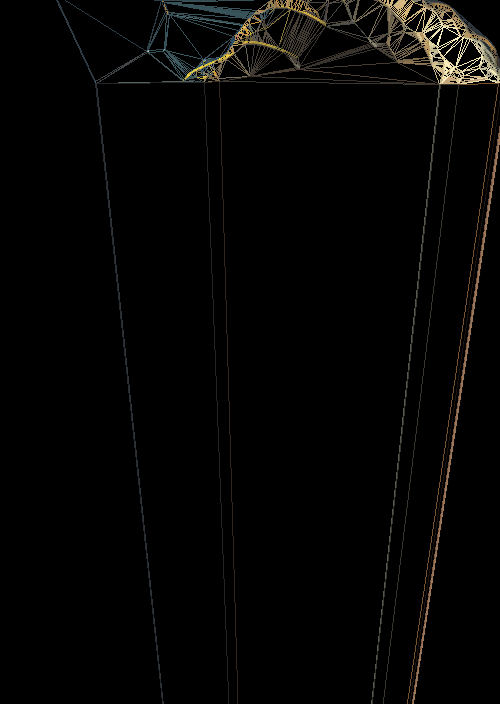

Weaver weaves a spider tapestry of your favorite image.

    make; ./weaver path/to/image.png threshold

Dependencies:

    SDL2-devel

    SDL2_image

Play with threshold (0-255) for weave intensity. Intense weaves take a long time.

